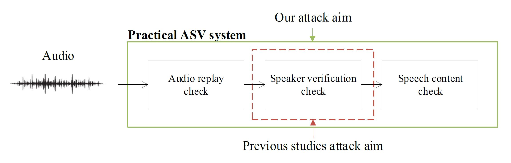
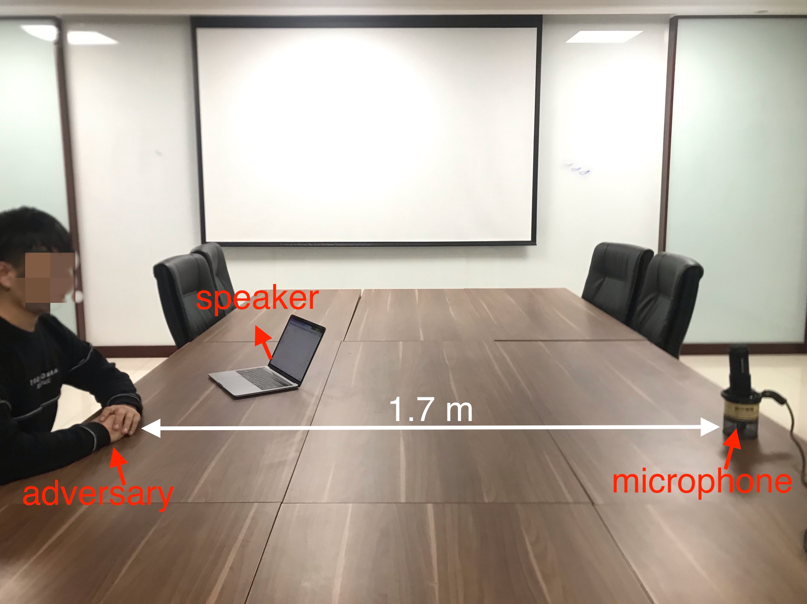

# Attack_practical_asv
This is the code and note for our ICASSP 2021 submission: "Attack on practical speaker verification system using universal adversarial perturbations"

<div align="center">  

</div>

## How to run the code
### 1. Data preparation
You should download [LibriSpeech test-clean data set](http://www.openslr.org/resources/12/test-clean.tar.gz) and [BUT Speech@FIT Reverb Database](https://obj.umiacs.umd.edu/gammadata/dataset/eq/IRs_release.zip). Remember the path where they are saved.

### 2. Pretrained models
Their [model](https://github.com/clovaai/voxceleb_trainer) is used as our speaker embedding encoder. Please download the pretrained model [here](http://www.robots.ox.ac.uk/~joon/data/baseline_v2_ap.model) and put it in ``./checkpoint/`` folder. To evaluate EER and minDCF for the pretrained model, you can change the ```path config``` in ```./config/eval_libri_speaker.yaml``` and run the following command. You will a **1.36% EER** with **0.4321 score threshold** on LibriSpeech test-clean data set.

```
python Testspeaker.py --config config/eval_libri_speaker.yaml
```

### 3. Generate splits
There are 40 speaker in LibriSpeech test clean set. We have to select enrolling, training, and testing audios for each speaker. You can set the number of enrolling and training audios in ``./datas/splits.py``. Also you have to change the ``wav_path`` in it to your save path. Just run ``python ./datas/splits.py`` to generate the split files in ``./datas/splits/`` folder.

### 4. Perform two-step attack
Change configs in ```./config/attack_config.yaml``` and then run the following command. It has four main parts: enrolling for every speaker, match differen adversary and targeted speaker pairs including intra-gender and inter-gender matchs, generate adversarial perturbation for each pair on train audios, evaluate the perturbation on test audios. The results will be written into a txt file in your config ```out_path```.

```
python attack.py --config config/attack_config.yaml
```

### 5. Evaluate adversarial examples
When generating every perturbation, the testing process followed.You could find the test result in ```out_path```. But it also should support evaluating the perturbation separately if using different test audios of the adversary. 

To evaluate the attack success rate of audio adversarial examples, you should first combine the adversarial perturbation and test audios. You can use the following command to generate adversarial examples. Change the ```wav_root``` to your data save path and ```noise_root``` to the adversarial perturbation save path.

```
python generate_adv_examples.py --wav_root /path/to/wav_data --wav_file ./datas/splits/test.txt --noise_root /path/to/adversarial_perturbation --out_root ./output
```

If your training process includes RIR simulation, you should run the following command to generate adversarial examples with test RIRs.

```
python generate_adv_examples.py --rir --rir_root /path/to/rir_wavs --wav_root /path/to/wav_data --wav_file ./datas/splits/test.txt --noise_root /path/to/adversarial_perturbation --out_root ./output
```

After generating the adversarial examples, you can change the ```path config``` in ```config/test_config.yaml``` and run the following command to get the attack success rate.
```
python Testattack.py --config config/test_config.yaml
```

## Experimental results
### 1. Digital attack without RIR

|Attack type          |Steps|ASR(%)|WER(%)|SNR(dB)|
|:-------------------:|:---:|:----:|:----:|:-----:|
|Clean data           |N/A  |0     |12.95 |N/A    |
|intra-gender/baseline|236  |98.43 |32.33 |16.90  |
|intra-gender/ours    |846  |98.65 |19.43 |23.66  |
|inter-gender/baseline|617  |96.63 |37.57 |16.55  |
|inter-gender/ours    |1872 |96.40 |21.53 |22.26  |

### 2. Digital attack with RIR

|Attack type          |Steps|ASR(%)|WER(%)|
|:-------------------:|:---:|:----:|:----:|
|Clean data with rir  |N/A  |0     |29.17 |
|intra-gender/baseline|279  |99.21 |79.33 |
|intra-gender/ours    |1003 |98.82 |66.48 |
|inter-gender/baseline|748  |97.20 |82.71 |
|inter-gender/ours    |1525 |96.41 |72.47 |

### 3. Physical attack

Physical attack setting scenario:

<div align="center">  

</div>

Intra-gender attack
|Attack type          |ASR(%)|WER(%)|CER(%)|
|:-------------------:|:----:|:----:|:-----:|
|Clean                |0     |11.42 |5.78   |
|Gaussian             |0     |17.77 |10.06  |
|Baseline             |80.00 |21.82 |14.48  |
|Ours                 |100.00|14.97 |7.53   |

## References
Our ASV model code is cloned from their project.

```
@inproceedings{chung2020in,
  title={In defence of metric learning for speaker recognition},
  author={Chung, Joon Son and Huh, Jaesung and Mun, Seongkyu and Lee, Minjae and Heo, Hee Soo and Choe, Soyeon and Ham, Chiheon and Jung, Sunghwan and Lee, Bong-Jin and Han, Icksang},
  booktitle={Interspeech},
  year={2020}
}
```

## Cite
If you find our paper is useful for your work, please cite the following.

```
@unpublished{wei2021practical,
  title={Attack on practical speaker verification system using universal adversarial perturbations},
  author={Weiyi, Zhang and Shuning, Zhao and Le, Liu and Jianmin, Li and Xingliang, Cheng and Thomas, Fang Zheng and Xiaolin, Hu},
  note = {Submitted},
  year={2021}
}
```
